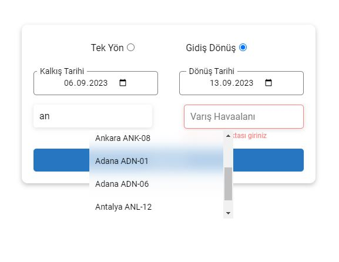
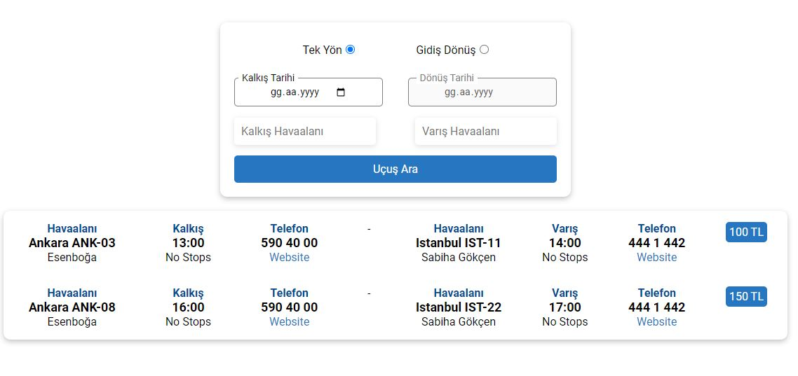
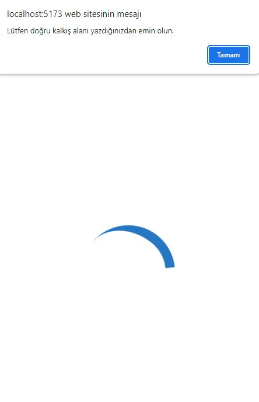

<h2>Amadeus Case Study - Sertaç Can</h2>
Case Study: Flight Search Application (UI Developer)

<h3>Project Setup</h3>

- Installation for package: `npm install`
- Start project: `npm run dev`
- Server port: http://localhost:5173/

<h3>Mock api</h3>

I used JSON server for api request

- Installation json server: `npm install -g json-server`
- Start server: `json-server --watch /src/mock/db.json`
- Server port: http://localhost:3000/flights

<h2>Overview</h2>

The user can search for airports using the application and see suitable places based on their chosen airport, departure, and arrival locations.

<h3>Build with</h3>

- CSS custom properties
- Flexbox
- React
- Vite
- Formik
- Yup
- Axios
- esLint

<h3>UX Part</h3>

- Form validations.
- Loading screen until data arrives.
- Active/deactive button with color variance.
- Hover effect.
- Departure date always start today's date.
- The arrival date cannot be smaller than the selected departure date.
- If there is an incorrectly entered airport name, provide feedback through an alert.
- If there is a server problem, show an alert indicating what the problem is.

<h3>Screenshot</h3>

More screenshot in screenshot folder.

https://github.com/SertacN
